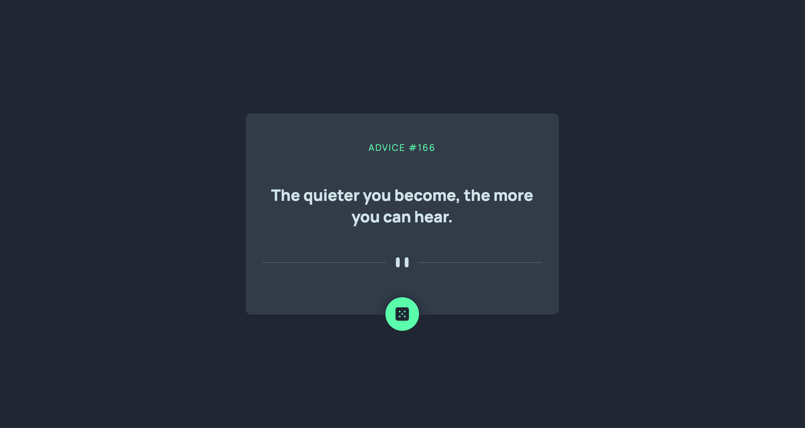

# Frontend Mentor - Advice generator app solution

This is a solution to the [Advice generator app challenge on Frontend Mentor](https://www.frontendmentor.io/challenges/advice-generator-app-QdUG-13db). Frontend Mentor challenges help you improve your coding skills by building realistic projects.

## Table of contents

- [Overview](#overview)
  - [The challenge](#the-challenge)
  - [Screenshot](#screenshot)
  - [Links](#links)
- [My process](#my-process)
  - [Built with](#built-with)
  - [What I learned](#what-i-learned)
- [Author](#author)

## Overview

### The challenge

Users should be able to:

- View the optimal layout for the app depending on their device's screen size
- See hover states for all interactive elements on the page
- Generate a new piece of advice by clicking the dice icon

### Screenshot



### Links

- Solution URL: (https://alfiemitchell123.github.io/Advice-Generator/)

## My process

### Built with

- Semantic HTML5 markup
- CSS custom properties
- Flexbox
- CSS Grid
- Sass
- Mobile-first workflow
- JavaScript

### What I learned

I learned about using third-party APIs within JavaScript. I had recently used asynchronous functions and the fetch API in another challenge, and so I used my knowledge from that to incorporate it into this project.

```js
async function fetchData() {
    const apiUrl = "https://api.adviceslip.com/advice";

    try {
        const res = await fetch(apiUrl);

        if (!res.ok) {
            throw new Error('Network response was not ok');
        }

        const data = await res.json();
        console.log(data);

        quoteId.innerHTML = `Advice #${data.slip.id}`;
        quote.innerHTML = `${data.slip.advice}`;

    } catch (error) {
        console.log('Fetch error: ', error);
    }
}

```

## Author

- Frontend Mentor - [@yourusername](https://www.frontendmentor.io/profile/alfiemitchell123)